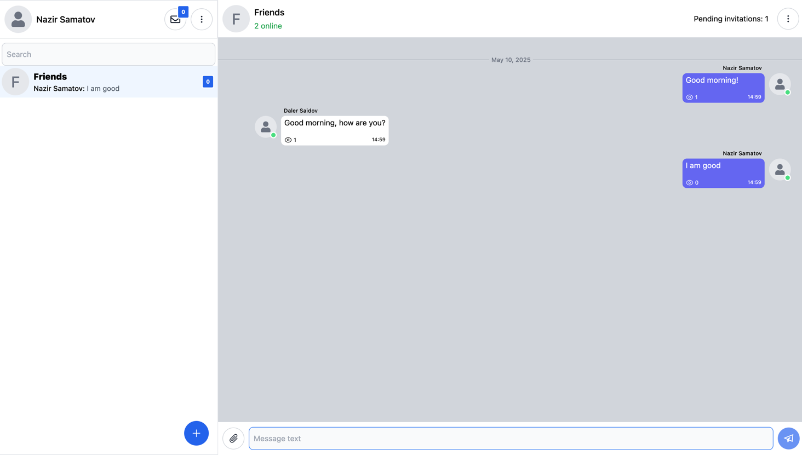
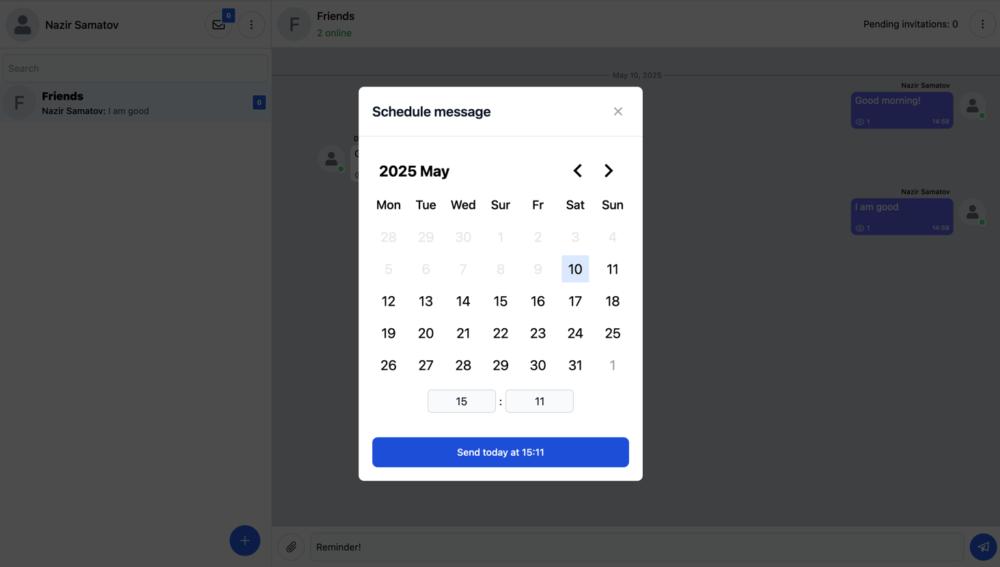

# Work in progress!!!

## Notable Features:

- Schedule messages
- See user online status
- See users currently typing
- Real time changes using WebSockets
- User invites
- Custom form library
- Custom ui library

## Tech stack:

- React
- GraphQL
- TypeScript
- PostgreSQL
- Node.js
- Superbase
